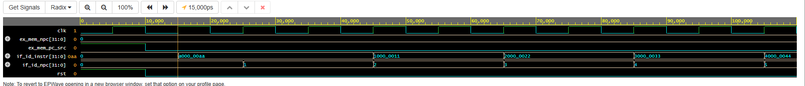
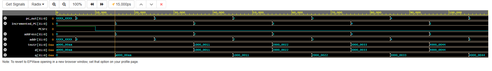

# MIPS PIPELINE 
## Instruction Fetch Stage 
Fetch Testbench Timing Diagram 

IF Stage Timing Diagram

## Decode Stage 
Decode Testbench 

Control Testbench 

RegisterFile Testbench 

Sign Extend Testbench 

## Excecute State 
ALU CONTROL Testbench

ALU Testbench 

Excecute Testbench

Memory Testbench

